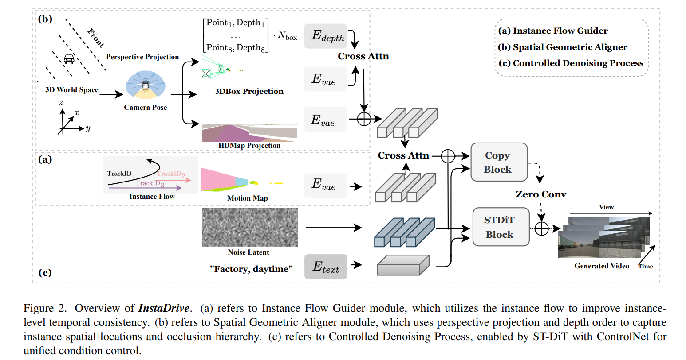
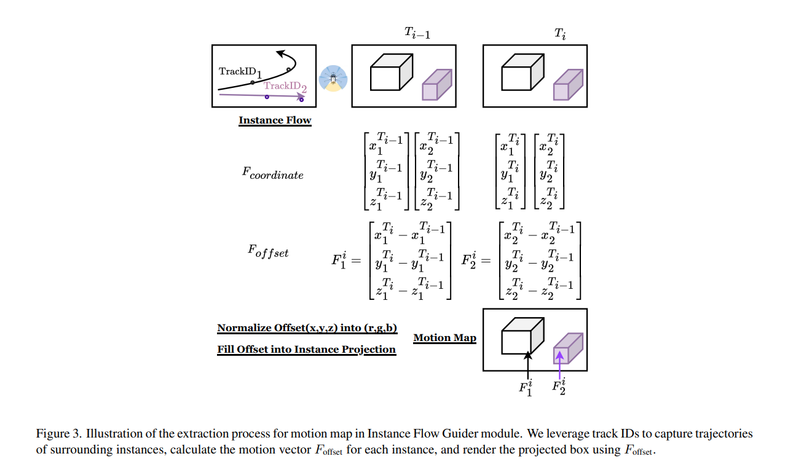

# InstaDrive: Instance-Aware Driving World Models for Realistic and Consistent Video Generation

## Project Links

| Category              | Link                                                         | Badge                                                        |
| --------------------- | ------------------------------------------------------------ | ------------------------------------------------------------ |
| **Demo**  | [Live Demo](https://shanpoyang654.github.io/InstaDrive/page.html) |         |
| **Paper**    | [arXiv Paper](https://www.researchgate.net/publication/394053515_InstaDrive_Instance-Aware_Driving_World_Models_for_Realistic_and_Consistent_Video_Generation)              |         |
 

---

## Abstract

Autonomous driving relies on robust models trained on high-quality, large-scale multi-view driving videos for tasks like perception, tracking, and planning. While world models offer a cost-effective solution for generating realistic driving videos, they struggle to maintain instance-level temporal consistency and spatial geometric fidelity. To address these challenges, we propose **InstaDrive**, a novel framework that enhances driving video realism through two key advancements:

1. **Instance Flow Guider module** — extracts and propagates instance features across frames to enforce temporal consistency, preserving instance identity over time.
2. **Spatial Geometric Aligner module** — improves spatial reasoning, ensures precise instance positioning, and explicitly models occlusion hierarchies.

By incorporating these instance-aware mechanisms, InstaDrive achieves state-of-the-art video generation quality and enhances downstream autonomous driving tasks on the nuScenes dataset. Additionally, we utilize CARLA's autopilot to procedurally and stochastically simulate rare yet safety-critical driving scenarios across diverse maps and regions, enabling rigorous safety evaluation for autonomous systems.

---

## 1. Multimodal Condition Controllability

**注**: 本节视频示例按页面提供的原始文件路径引用（本地或站点 `./data/...`）。

### 1.1 Layout Controllability

InstaDrive responds precisely to control conditions like box projection, map projection, and instance flow. We overlay the 3D bounding box projections onto the generated videos.

* **示例 A** — Oncoming bus, parked car on center divider, pedestrian, roundabout, parked trucks.
  视频：[./data/Layout_controlability/ex2.mp4](./data/Layout_controlability/ex2.mp4)
  描述：Drivable areas, sidewalks, and zebra crossings are faithfully generated following the road map projections. Objects in the scene are accurately placed and sized to align with their projected bounding boxes.

* **示例 B** — Wait at intersection, pedestrians on sidewalk, turn right, cones, cross intersection.
  视频：[./data/Layout_controlability/ex3.mp4](./data/Layout_controlability/ex3.mp4)
  描述：Small and densely packed objects are precisely rendered at their correct locations, following 3D bounding box coordinates. Objects track their previous attributes as guided by the instance flow, ensuring temporal consistency across frames.

---

## 2. Qualitative Comparison

### 2.1 Comparison with Baseline

#### a. Instance-Level Temporal Consistency

* **Panacea (baseline)**: `./data/Qualitative_comparison/temporal/Panacea/pred.mp4`
* **InstaDrive**: `./data/Qualitative_comparison/temporal/InstaDrive/pred.mp4`

**说明**：In Panacea, the direction of the white car's front head (in FrontLeft and BackLeft view) changes over time. In InstaDrive, our model preserves the white car's attributes, demonstrating superior temporal consistency.

#### b. Occlusion Hierarchy

* **Panacea (baseline occlusion example)**: `./data/Qualitative_comparison/occlusion/Panacea/occ.mp4`
* **InstaDrive (occlusion example)**: `./data/Qualitative_comparison/occlusion/InstaDrive/pred.mp4`

**说明**：例子中有一个静止的箱子（FrontLeft 视角停车位）位于更远处，移动箱子更近。在 Panacea 中，远处的静止箱子错误地放在前面，遮挡了更近的移动车辆，违反预期的遮挡层次。在 InstaDrive 中，我们正确渲染了更近的移动箱子在前，远处静止箱子被适当遮挡。

#### c. Spatial Localization（空间定位）

* **Panacea (空间示例)**: `./data/Qualitative_comparison/spatial/Panacea/pred.mp4`
* **InstaDrive (空间示例)**: `./data/Qualitative_comparison/spatial/InstaDrive/pred.mp4`

**说明**：在 MagicDrive-V2 或其他 baseline 中，FrontRight 视角的车辆可能偏离 bounding box 控制信号。而在 InstaDrive 中，我们保持准确的空间定位，确保对象位置和尺寸符合控制信号。

---

### 2.2 More Results

更多实验结果示例（用于展示模型在各种情形下的鲁棒性和多样性）：

* **a. Instance-Level Temporal Consistency (更多示例)**
  视频：`./data/Diversity/structure_and_content/ex5.mp4`
  说明：展示模型在复杂场景中保持实例属性随时间一致性。

* **b. Occlusion Hierarchy (更多示例)**
  视频：`./data/Diversity/structure_and_content/occlusion1.mp4`
  说明：进一步确认模型在遮挡关系处理上的正确性。

* **c. Spatial Localization (更多示例)**
  视频：`./data/Diversity/structure_and_content/ex3.mp4`
  说明：展示模型在不同场景下维持对象空间定位的能力。

---

## 3. Scenario Simulation Using CARLA-Generated Layouts

InstaDrive can generate driving videos based on layout conditions provided by the CARLA simulator. We leverage CARLA's waypoint mechanism to randomly generate various events across different maps and regions.

### 3.1 Corner Case in Autonomous Driving

* **示例 a** — The vehicle ahead brakes, prompting the ego vehicle to decelerate and stop.
  视频：`./data/Carla/brake2.mp4`
  描述：模拟前车刹车场景，评估在突发制动情况下的生成与行驶行为可视化。

* **示例 b** — Vehicle cutting in from the right lane.
  视频：`./data/Carla/cut-in.mp4`
  描述：模拟车辆并线切入，测试模型在复杂交通交互下的生成稳定性与合理性。

### 3.2 Long-term Generation (2x speed)

InstaDrive can simulate long-duration driving scenarios based on the Carla-Generated layout conditions. We generate new plausible content on the fly and maintain a consistent world for up to **1 min** (2× speed used for demonstration). This duration significantly exceeds that of videos in the nuScenes dataset.

* 视频（long-term 示例）：`./data/Carla/long3-final.mp4`
  描述：展示模型在长时序生成下保持世界一致性和内容连贯性的能力。

---

### 其他说明

* 本 Markdown 保留了页面中原始的标题、段落和媒体路径。
* Markdown 中的视频通常以文件链接方式展示（取决于目标平台是否支持内嵌播放）。如果需要在 GitHub README 里内嵌预览，建议先把关键帧或缩略图作为图片，然后链接到 mp4 文件或页面。
* 如果你希望我把所有视频改成**可直接内嵌（HTML `<video>` 标签）**的形式，或生成每个视频对应的缩略图并嵌入到 Markdown，我可以替你批量生成示例代码。

---

需要我把这个 Markdown 再做成 GitHub README 的最终版（含缩略图、内嵌视频示例或 toc 目录）吗？
